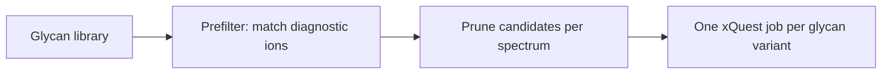

# Glycan libraries

GlycoQuest uses a **glycan library** to (1) match diagnostic oxonium ions in the prefilter and (2) generate per-glycan xQuest search jobs with the correct variable-modification masses.

## Bundled databases

| CLI `--glycans` | Compositions | Type | Default attachment |
|-----------------|--------------|------|-------------------|
| `nglyc309` | 309 | N-linked | Asn (`N`) |
| `oglyc78` | 78 | O-linked | Ser / Thr (`S`, `T`) |
| `msv000087442-sianaz` | 9 | Xie 2021 PNT2 SiaNAz N-glycoforms | Asn (`N`) |

Aliases: `nglyc`, `n-glycan`, `oglyc`, `o-glycan`.

```bash
# N-glycans (default)
glycoquest run.mzXML --database proteins.fasta --glycans nglyc309

# O-glycans
glycoquest run.mzXML --database proteins.fasta --glycans oglyc78
```

For the MSV000087442 PNT2 experiment, select both the dataset library and its
required linker chemistry:

```bash
glycoquest data/MSV000087442/PNT2-crosslink-in-situ.mzXML \
  --database data/MSV000087442/PNT2-GPx-focused-xquest.fasta \
  --glycans msv000087442-sianaz \
  --crosslinker nhs-cyclooctyne \
  --config configs/msv000087442-full.ini \
  --xquest-root V2.1.7/xquest \
  --out out
```

The nine reported compositions generate 27 jobs: intact, `-H2O`, and `-2H2O`
variants for each glycoform. The library uses ordinary NeuAc masses and adds the
SiaNAz diagnostic ion at m/z 333.1040; the linker preset supplies the
SiaNAz-for-NeuAc mass difference.

Source files live under `databases/` and are converted at load time using
`glycan_residues.txt` and `diagnostic_ion_catalog.txt`.

Override the data directory with `GLYCOQUEST_GLYCAN_DATA_DIR`.

## Custom CSV/TSV library

Pass a file path to `--glycans`:

```bash
glycoquest run.mzXML --database proteins.fasta --glycans my_glycans.tsv
```

### Required columns

| Column | Description |
|--------|-------------|
| `name` | Unique glycan identifier |
| `composition` | Human-readable composition, e.g. `HexNAc(2)Hex(5)` |
| `monoisotopic_mass` | Monoisotopic mass (Da) added as variable mod |
| `diagnostic_ions` | `;`-separated list: `family@mz` or `family@mz[-loss]` |
| `residue_targets` | `;`-separated attachment residues, e.g. `N` or `S;T` |

### Example rows

```text
name,composition,monoisotopic_mass,diagnostic_ions,residue_targets
HexNAc1,HexNAc(1),203.079373,HexNAc@204.0867;HexNAc@186.0760[-H2O];HexNAc@168.0654[-2H2O],N
NeuAc1HexNAc1,NeuAc(1)HexNAc(1),494.174789,NeuAc@292.1027;NeuAc@274.0921[-H2O],N;S;T
```

### Diagnostic ion format

- `family@mz` — base oxonium ion mass
- `family@mz[-loss_label]` — neutral-loss variant; deltas come from `diagnostic_ion_catalog.txt` for bundled data

At least one diagnostic ion per glycan is required (empty lists are rejected).

## How the library drives the workflow



1. **Prefilter** — union of all diagnostic targets from the library is matched against each MS/MS scan.
2. **Pruning** — per spectrum, keep glycans whose composition contains every diagnostic **family** observed.
3. **Jobs** — each retained (spectrum × glycan × loss variant) becomes an xQuest job with `variable_mod` on the configured residues.

## N-glycans vs O-glycans

| Aspect | N-glycans (`nglyc309`) | O-glycans (`oglyc78`) |
|--------|------------------------|------------------------|
| Attachment | Asn | Ser, Thr |
| xQuest `variable_mod` | `N,<mass>` → pseudo `X` | `S,<mass>` / `T,<mass>` |
| Sequon check | N-X-S/T (X ≠ P) in soft score | Not applicable |

## Water-loss variants

GlycoQuest generates separate search jobs for parent glycan mass and water-loss forms (−18.01 Da). The `loss_label` column in results identifies which variant matched.

## Validation errors

Common failures when loading a custom file:

- Missing required column
- Duplicate `name`
- Non-numeric mass or invalid ion format
- Empty `diagnostic_ions`

## Related

- [Diagnostic ions](../theory/diagnostic-ions.md)
- [Prefilter — glycan pruning](../workflow/prefilter.md#gate-3-glycan-pruning)
- [xQuest jobs — variable modifications](../workflow/xquest-jobs.md#variable-modifications-and-pseudo-residues)
