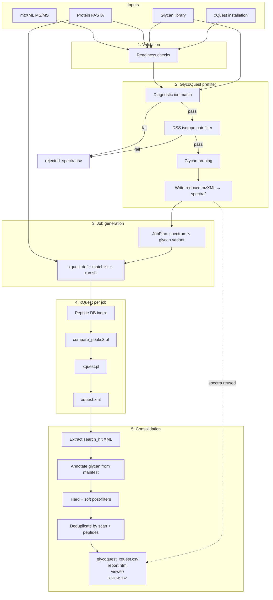

# Workflow overview

GlycoQuest connects **glycan-aware pref filtering** to **xQuest crosslink search** and **annotated consolidation**. This page is the map; each stage has a dedicated guide.

## Stages

| Stage | Component | Input | Output |
|-------|-----------|-------|--------|
| 1. Validate | GlycoQuest | mzXML, FASTA, glycan lib, xQuest | Readiness report |
| 2. Prefilter | GlycoQuest | All MS2 scans | `filtered_spectra.tsv`, `spectra/` |
| 3. Plan jobs | GlycoQuest | Pruned glycan × spectrum pairs | `plan.json`, `tmp/jobs/` |
| 4. Search | xQuest (per job) | `xquest.def`, matchlist, mzXML | `results/xquest.xml` |
| 5. Consolidate | GlycoQuest | Job XML + manifest | CSV, report, viewer, network CSV |

## Data flow (detailed)

## Execution modes

| Mode | Flag | Prefilter | xQuest | Consolidation |
|------|------|-----------|--------|---------------|
| Dry-run | `--dry-run` | Yes | No | No |
| Full run | *(default)* | Yes | Yes | Yes |

## One glycan per xQuest job

xQuest supports up to four variable-modification pseudo-residues (`X`, `U`, `B`, `J`). GlycoQuest assigns **one glycan composition (± loss variant) per job** so that:

- `variable_mod` encodes the glycan mass on N/S/T
- Optional oxidation occupies another pseudo slot
- Results map cleanly back to a single glycan candidate

This can produce many jobs on large datasets; `plan.json` reports job count and
exact spectrum–job assignments before execution.

## Parallelism

Jobs are independent (separate directories, separate peptide indexes). GlycoQuest runs `run.sh` concurrently via a thread pool sized by `--jobs` or `[execution] job_parallelism`.

## Where to read next

| Topic | Page |
|-------|------|
| Diagnostic ions, isotope pairs, pruning | [Prefilter](prefilter.md) |
| Job folders, defs, matchlists | [xQuest jobs](xquest-jobs.md) |
| Pass/fail rules and soft score | [Post-filter](postfilter.md) |
| Output file tree | [Output files](../results/output-files.md) |

## Reference data and run planning

Published GPx datasets exist in MassIVE, including `MSV000093174` (Chen et al., 2025) and the publicly downloadable `MSV000087442` (Xie et al., 2021). GlycoQuest includes `nhs-cyclooctyne`, `ssbxl`, and `pcbxl` models for their azido-sialic-acid/NHS chemistry. See [Published reference datasets](../theory/glycopeptide-crosslinking.md#published-reference-datasets) for citations, exact masses, access status, and the executed MSV000087442 proof of concept.

Run a dry-run on your own experiment and inspect `plan.json` for the scan funnel,
job count, and spectrum–job assignments before launching xQuest.
