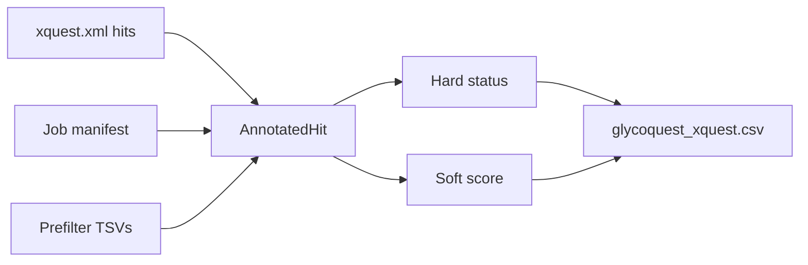

# Post-filter

After xQuest returns `search_hit` entries, GlycoQuest **annotates** each hit with glycan context from the job manifest and prefilter, then applies **hard** (pass/fail) and **soft** (ranking) rules.

## Annotation pipeline



For each hit, GlycoQuest determines:

- Which **glycan** was searched (from manifest, or job id if resuming)
- Which **scan** produced the spectrum (parsed from xQuest spectrum id)
- **Diagnostic evidence** from the originating filtered spectrum
- **Glycosylation site** by decoding pseudo-residues in `seq1`/`seq2`
- **Sequon** presence for Asn-linked glycans (N-X-S/T)

Hits are **deduplicated** across per-glycan jobs (same scan + peptide pair), keeping the highest `soft_score`.

## Hard requirements (`hard_status`)

All must pass for `postfilter_status=pass`:

| Status code | Requirement |
|-------------|-------------|
| `pass` | All checks satisfied |
| `fail_no_xlink` | Missing crosslink evidence (`xlink_position` and `topology` empty) |
| `fail_no_glycan` | No glycan pseudo-residue across the peptide pair |
| `fail_multiple_glycans` | More than one glycan pseudo-residue across the peptide pair |
| `fail_no_diagnostic` | Originating spectrum lacks diagnostic evidence *(full runs only)* |
| `fail_precursor_error` | \|precursor error\| > `max_precursor_error_ppm` |
| `fail_score` | xQuest `score` < `min_score` |

### V1 target class: peptide–glycopeptide

GlycoQuest V1 targets crosslinks where **one** peptide carries the glycan and the other does not:

- `n_glycan_pseudo` must equal **1**
- Hits with no glycan pseudo are rejected (`fail_no_glycan`)
- Glycopeptide–glycopeptide and multiply glycosylated hits are rejected (`fail_multiple_glycans`)

```
Allowed:     Peptide ——Xlink—— Glycopeptide(X)
Rejected:    Glycopeptide(X) ——Xlink—— Glycopeptide(X)
```

## Soft score (`soft_score`)

Used for ranking and deduplication; does not alone determine pass/fail.

Starting from xQuest `score`:

| Adjustment | Condition |
|------------|-----------|
| +1.0 | N-glycan sequon present (N-X-S/T, X ≠ P) at glycosite |
| +0.5 | Precursor charge plausible (2–7) |
| +0.1 per ion (max +1.0) | Diagnostic ions matched in originating spectrum |
| −0.0 to −1.0 | Penalty from \|precursor error ppm\| / 10 |

Configure hard thresholds in `[limits]`:

```ini
[limits]
min_score = 0
max_precursor_error_ppm = 20
```

## Charge plausibility

`charge_plausible` is true when precursor charge is **2–7**. Glycopeptide–peptide crosslinks often appear at +4 to +6, but +2–7 is treated as reasonable when metadata is present.

## Reading outcomes in outputs

| Artifact | Post-filter content |
|----------|---------------------|
| `glycoquest_xquest.csv` | `hard_status`, `soft_score`, `postfilter_status` columns |
| `report.html` | Outcome breakdown chart, distributions over passing hits |
| `viewer/` | QC outcomes; filter "Show failed hits" |
| `xiview.csv` | Typically **passing** hits only |

## Related

- [Interpreting hits](../results/interpreting-hits.md)
